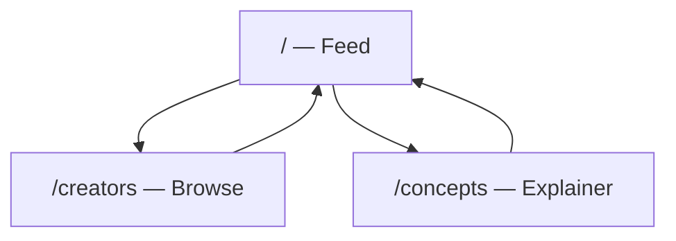

# Pitstop — Product Requirements Document

**Tagline:** The marketplace for armpit lovers.

|                  |            |
|------------------|------------|
| **Status**       | Draft      |
| **Last updated** | 2026-07-05 |

---

## Overview

Pitstop is the new go-to website for armpit fetishists — a marketplace that brings together armpit content creators and
the people who appreciate their work. Creators generate content; enthusiasts discover and (eventually) pay for it via
one-time purchases or subscriptions.

For the MVP, all content is dummy and LLM-generated. The site is fully static — no backend, no auth, no payments.

Pitstop exists at the intersection of three intentions: partly a real business venture, partly a joke, and partly an art
project. The tone is **classy, intimate, sensual, light, and funny (lots of double-entendre)**.

---

## Goals and non-goals

### Goals (MVP)

- Ship a static, browsable site on Cloudflare with three pages
- Establish brand tone through copy, typography, and layout
- Use plausible dummy content so the site feels like a real product demo

### Non-goals (MVP)

- User accounts, authentication, payments, or subscriptions
- Real creator onboarding or user-generated content
- Backend, database, or dynamic APIs

### Future (out of scope for MVP)

- One-time purchases and creator subscriptions
- Creator profiles with real media uploads
- Search, filters, and notifications

---

## Target audience and personas

| Persona            | Role                        | Needs                                                       |
|--------------------|-----------------------------|-------------------------------------------------------------|
| **The Enthusiast** | Consumer / armpit fetishist | Discover content, browse creators, understand the community |
| **The Creator**    | Content producer (future)   | Showcase work, monetize via tips/subscriptions (not MVP)    |

**The Enthusiast** browses the feed for new content, explores creator profiles, and wants a site that feels curated and
intentional — not clinical or crude. They may be unfamiliar with the terminology and appreciate the Concepts page.

**The Creator** (future) wants a platform to build an audience and earn from their work. In MVP, creators exist only as
fictional dummy profiles that demonstrate the marketplace concept.

---

## Information architecture

**Global navigation:** logo/home · Creators · About (Concepts)

**Footer:** playful disclaimer, link to Concepts, placeholder legal line

All routes are static. No auth-gated pages in MVP.

---

## Page specifications (MVP)

Each page spec includes purpose, key sections, content requirements, and acceptance criteria.

### Home — Feed (`/`)

**Purpose:** Social-style scrollable feed of dummy posts.

**Key sections:**

- Hero tagline
- Feed of post cards (static list; infinite scroll not required)

**Post card fields:**

- Creator avatar (placeholder)
- Display name
- Timestamp
- Image placeholder
- Caption
- Faux engagement counts (likes, comments)
- Optional "Subscribe" CTA — disabled or links to Concepts

**Acceptance criteria:**

- [ ] At least 8–12 dummy posts visible without a backend
- [ ] Responsive layout, mobile-first
- [ ] Feed feels scrollable and social, not a blog index

### Creators — Browse (`/creators`)

**Purpose:** Grid or list of fictional creators.

**Creator card fields:**

- Avatar
- Display name
- Tagline
- Follower count (dummy)
- Preview thumbnail

Creator detail pages at `/creators/[slug]` are optional stretch goal; default MVP is cards only with no detail page.

**Acceptance criteria:**

- [ ] At least 6 dummy creators
- [ ] Grid reflows on mobile, tablet, and desktop
- [ ] Copy reinforces marketplace positioning without implying real transactions

### Concepts — Explainer (`/concepts`)

**Purpose:** Educate visitors unfamiliar with axillism; set the project's playful-but-classy tone.

**Key sections:**

1. What is axillism / maschalagnia (plain language)
2. How Pitstop works (conceptual — not functional in MVP)
3. FAQ (3–5 questions), e.g.:
    - "Is this real?"
    - "Why armpits?"
    - "How do creators join?"
4. Tone: witty, funny, never clinical or crude

**Acceptance criteria:**

- [ ] Readable without prior knowledge of the subject
- [ ] Links back to Home and Creators
- [ ] Sets expectations that MVP is a demo / art piece

---

## Content model

Static data shapes for dummy content (JSON or Markdown in repo, built at deploy time).

### Post

| Field          | Type              | Notes              |
|----------------|-------------------|--------------------|
| `id`           | string            | Unique identifier  |
| `creatorId`    | string            | References Creator |
| `caption`      | string            | LLM-generated copy |
| `imageUrl`     | string            | Placeholder image  |
| `postedAt`     | string (ISO date) | Display timestamp  |
| `likeCount`    | number            | Fictional          |
| `commentCount` | number            | Fictional          |

### Creator

| Field             | Type   | Notes              |
|-------------------|--------|--------------------|
| `id`              | string | Unique identifier  |
| `slug`            | string | URL-safe name      |
| `displayName`     | string | Fictional name     |
| `tagline`         | string | Short bio line     |
| `avatarUrl`       | string | Placeholder avatar |
| `followerCount`   | number | Fictional          |
| `previewImageUrl` | string | Card thumbnail     |

### Concept section

| Field   | Type     | Notes           |
|---------|----------|-----------------|
| `title` | string   | Section heading |
| `body`  | Markdown | Section content |
| `order` | number   | Display order   |

**Content sourcing:** LLM-generated copy and placeholder images (e.g. abstract crops, generated avatars, or solid-color
placeholders). All names and stats are fictional.

---

## Design and tone guidelines

| Dimension      | Direction                                                                            |
|----------------|--------------------------------------------------------------------------------------|
| **Voice**      | Confident, warm, slightly tongue-in-cheek; never vulgar or medical                   |
| **Typography** | Serif or refined sans for headings; clean sans for body; generous line-height        |
| **Color**      | Warm neutrals — cream, soft brown, muted rose; avoid harsh reds or neon              |
| **Imagery**    | Placeholder-first; abstract or atmospheric crops rather than explicit content in MVP |
| **Motion**     | Subtle hover states; no heavy animation                                              |
| **Layout**     | Spacious, editorial; feed cards with rounded corners and soft shadows                |

**Example microcopy:**

- Hero headline: *"Where armpit appreciation finds its home."*
- CTA: *"Explore creators"* (links to `/creators`)
- Empty state: *"Nothing here yet — but the pit stops are coming."*

---

## Technical requirements (MVP)

| Area            | Recommendation                                                           |
|-----------------|--------------------------------------------------------------------------|
| **Hosting**     | Cloudflare Pages                                                         |
| **Framework**   | Astro or Next.js static export                                           |
| **Styling**     | Tailwind CSS or CSS modules                                              |
| **Content**     | Markdown/JSON in repo, built at deploy time                              |
| **Deploy**      | Git-connected Pages project; optional `wrangler.toml` for future Workers |
| **Performance** | Static assets, optimized images, no client-side data fetching            |
| **Domain**      | TBD (see Open questions)                                                 |

---

## Success criteria (MVP)

Qualitative — this is as much art piece as product:

- Site deploys successfully to Cloudflare
- All three routes load on mobile and desktop
- A first-time visitor understands what Pitstop is within 30 seconds
- Tone reads as intentional (classy / art), not accidental or broken

---

## Open questions

- Final domain name
- Creator detail pages (`/creators/[slug]`) — MVP or v1.1?
- Image strategy: placeholders only vs. curated stock photography
- Age gate / content warning — recommend a subtle footer disclaimer for MVP

---

## Glossary

- **Axillism / maschalagnia** — A type of partialism in which a person is sexually attracted to armpits (also spelled
  axilism).
- **Creator** — A content producer on Pitstop who publishes armpit-themed media. Fictional in MVP.
- **Feed** — The scrollable home page showing posts from creators, social-media style.
- **Pitstop** — This product; a marketplace connecting armpit content creators and enthusiasts.

---

*Changelog: Expanded from first draft (2026-07-05) with MVP specs, content model, and implementation guidance.*
